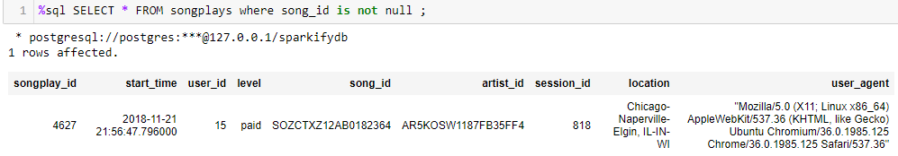

### Purpose of Database
Purpose of the database is to help the analytics team at Sparkify understand
what songs users are listening to on the new music streaming app.The data 
currently resides in a directory of JSON logs on user activity and a directory
of JSON metadata on songs in their app. The database is intended to make it
easier for the analytics to query their data.

### Running the Python scripts
There are three Python scripts **create_tables.py**,
**sql_queries.py**,and **etl.py**. The **sql_queries.py** contains all the
sql queries and is imported into **sql_queries.py** and **etl.py**.
The scripts **sql_queries.py** and **etl.py** can be run from the command
line.

### Database schema design and ETL pipeline
The database schema consists of a fact table: 

**songplays** - consists of records in log data associated with song plays

  - songplay_id, start_time, user_id, level, song_id, artist_id, session_id, location, user_agent

Dimension tables:

**users** - users in the app 

 - user_id, first_name, last_name, gender, level
  
**songs** - songs in music database 

  -  song_id, title, artist_id, year, duration
  
**artists** - artists in music database 

  -  artist_id, name, location, latitude, longitude
  
**time** - timestamps of records in songplays broken down into specific units 

  -  start_time, hour, day, week, month, year, weekday

The ETL pipeline extracts data from JSON logs on user activity and JSON metadata
on songs and loads the data into the fact and dimension tables.

### Song play analyis query result
An example of the song play analysis query result:   

### Functions

#### Functions in create_tables.py:

**def create_database():**  
    """  
    - Creates and connects to the sparkifydb  
    - Returns the connection and cursor to sparkifydb  
    """
    
**def drop_tables(cur, conn):**  
    """ 
    - Drops each table using the queries in `drop_table_queries` list.  
    """

**def create_tables(cur, conn):**  
    """
    - Creates each table using the queries in `create_table_queries` list.  
    """

**def main():**  
   """  
   - Drops (if exists) and Creates the sparkify database.  
   - Establishes connection with the sparkify database and gets 
    cursor to it.  
   - Drops all the tables.  
   - Creates all tables needed.   
   - Finally, closes the connection.    
  """

#### Functions in etl.py:  

**def process_song_file(cur, filepath):**  
   """  
   - Opens song file.  
   - Inserts song record.  
   - Inserts artist record.    
  """  
**def process_log_file(cur, filepath):**   
  """  
   - Opens log file.  
   - Filters by NextSong action.  
   - Converts timestamp column to datetime.  
   - Inserts time data records.   
   - Loads user table.    
   - Inserts user records.   
   - Inserts songplay records.    
  """    
**def process_data(cur, conn, filepath, func):**   
  """  
   - Gets all files matching extension from directory.  
   - Gets total number of files found.  
   - Iterates over files and process.    
    """  
**def main():**  
  """  
   - Establishes connection with the sparkify database and gets 
    cursor to it.  
   - Processes song and log files.  
   - Finally, closes the connection.    
  """

